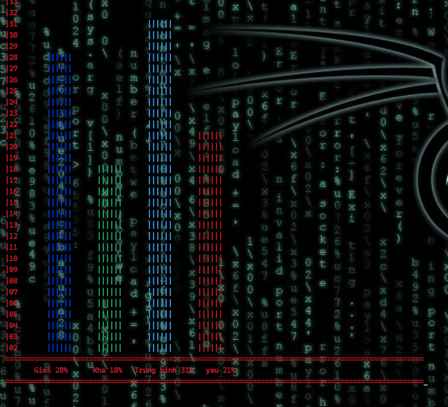

# BÁO CÁO BÀI TẬP - PHAN THANH TÙNG  - BDATTT58

## CHỨC NĂNG THÊM 

mã sinh viên phải đủ 8 chữ số 

năm sinh phải hợp lệ 

## CHỨC NĂNG DISLAY 

### theo id class

### theo điểm số 

## CHỨC NĂNG SORT

### sort theo điểm tăng dần  

### Sort theo name 

### Sort theo id_class

### Sort theo date tăng dần 

### Sort theo id student tăng dần 

## CHỨC NĂNG Search 

### tìm theo tên 

### tìm theo class nếu muốn tiếp tục lọc thông tin 

### tìm theo điểm nếu muốn tiếp tục lọc thông tin 

## CHỨC NĂNG Thống kê 

### Thống kê theo lớp 

### Thống kê theo điểm 

### Thống kê theo bảng 

